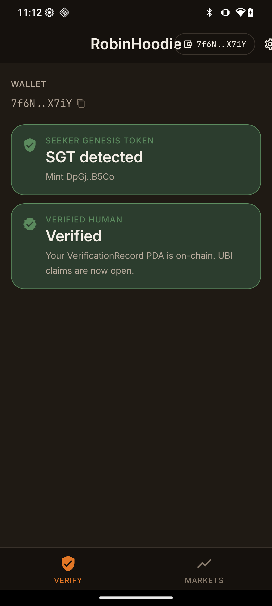
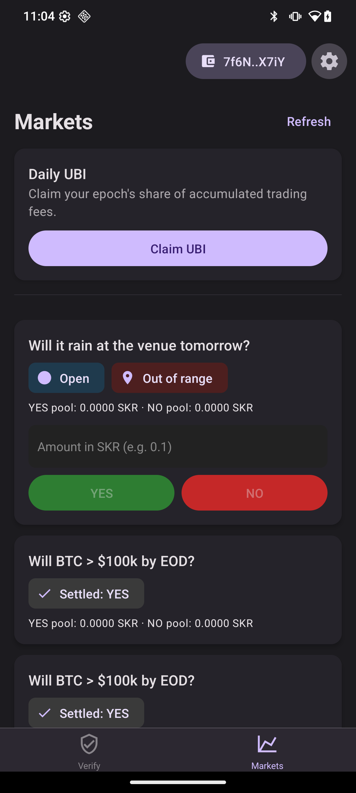
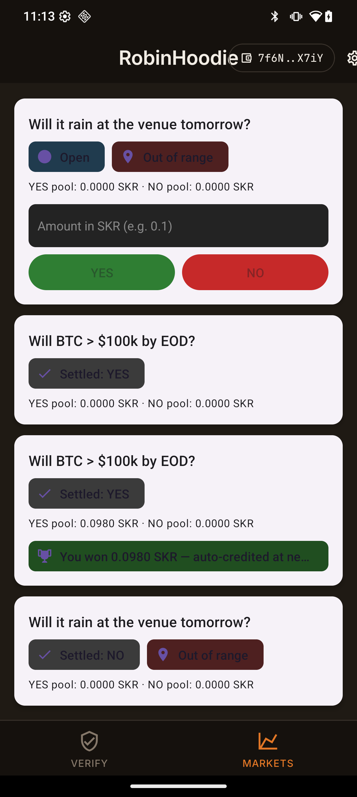

# Pied Piper

> **Hackathon prototype** — built solo in <24h for **EasyA Consensus Hackathon Miami, May 5–7, 2026**.
> Devnet only. Not for production use.

A mobile-first **prediction market on Solana** whose 2 % trading fees stream as **Universal Basic Income** to verified humans — where "verified human" means *cryptographically proven to own a [Solana Mobile Seeker](https://solanamobile.com/seeker)*.

The app cannot run without a Seeker. Personhood is gated on on-chain ownership of the device's **Seeker Genesis Token** (SGT, a Token-2022 NFT in the group `GT22s89nU4iWFkNXj1Bw6uYhJJWDRPpShHt4Bk8f99Te`) plus a Mobile Wallet Adapter `signMessage` challenge that flows through Seed Vault's hardware-backed biometric prompt.

> *The first prediction market that cannot exist without a Seeker — hardware-attested personhood unlocks fee-funded UBI.*

| | | |
| :---: | :---: | :---: |
|  |  |  |
| **Step 1** — SGT detected, biometric-signed `register_verification` writes a `VerificationRecord` PDA. | **Step 2** — Browse open markets. Geo-fenced market correctly greys out when out of range. | **Step 3** — Bet placed (0.098 SOL on YES) → market settled YES → trophy chip shows the win, auto-credited at next epoch. |

📹 [Slideshow demo (15 s, mp4)](media/demo.mp4) · 📦 Signed APK v0.1.0 (attach to a GitHub Release; not committed — `*.apk` is gitignored) · 📚 [`@piedpiper/sdk`](packages/sdk/) — donate to UBI from any Solana app

## End-to-end on devnet (real Seeker, this submission)

| Action | Tx | Confirmation |
| --- | --- | --- |
| `register_verification` | [`29Kk…NBdv`](https://explorer.solana.com/tx/29KkBLJUeHFRNA2MjFZvGboLeutjedkdZD8quUkscBNNFv8YhSZN1iV9XqvVbPenMexrshrt1aBcXxgZojzUcNBdv?cluster=devnet) | `VerificationRecord` PDA `2BSU…maX2` exists |
| `place_bet(YES, 0.1 SOL)` | [`2ySz…DwYW`](https://explorer.solana.com/tx/2ySzJddoDymahfM9UK9zMrfZJmS3nYFbAdPm8kLgTkvMXkX6Xh6wZik1B3wJ8UUtT5d3EBTovhDN9rbsp4eaDwYW?cluster=devnet) | Market `DntC…zhEb` YES vault holds 0.098 SOL; 0.002 SOL fee accrued to UbiPool |
| `claim_ubi` | [`64W5…NBdv`](https://explorer.solana.com/tx/64W5ZZkSpRMZwxfDVYH4xBPn6dj5cicT9VELGHwYpofSAZxijciGZm537pL4SPeRqmJWLVPrRh5njkPofUjqNBdv?cluster=devnet) | 0.002 SOL distributed to the (sole) verified Seeker for epoch `5927174` |
| `resolve_market(YES)` | [`2gh3…tKFq`](https://explorer.solana.com/tx/2gh3NNqdWE2uxYrzV2HuxqdjnQ1bDX3UkE8QaBJBG8dbmDAYxWcFmieuZvXoxvpywZcSKDkAPovCty1h3R7xtKFq?cluster=devnet) | Admin resolved, status flipped to settled, outcome `YES` |
| `donate_to_pool(0.05 SOL, "Acme Corp Q2 2026 welfare contribution")` (via `@piedpiper/sdk`) | [`4WrK…DFzg`](https://explorer.solana.com/tx/4WrKVr1LAzvrCDwkjsXkYpdQcByFWAkptH6s6n7twSv4X37tpafE6xUNwNe8rvU9aqDocsMGm3AGpdDuWS3bDFzg?cluster=devnet) | DonorRecord PDA `9qnV…7oPi` created; 0.05 SOL added to UbiPool's distributable counter |
| **SAS** `CreateCredential` ("PiedPiper" issuer) | [`tdcT…JNC`](https://explorer.solana.com/tx/tdcTKDWBLGWC1ePgnUiNVdU7H8egyGYUGqyZ7vVcDq6zqELBpVSeXh2mzDhFzdSYg7SFK4cEAEVEK8gbW7WnJNC?cluster=devnet) | Credential `B95y…ickq` |
| **SAS** `CreateSchema` ("Personhood" — wallet/sgt_mint/verified_at) | [`4wgf…a4sv`](https://explorer.solana.com/tx/4wgfQx35D8SFMM6mVkcm3ZNT515RvEWVPiq7cuCi9KsQSJSKbE6UX12EjBnqFTU5S9ZdZDScTzVJxJ1EwLpEa4sv?cluster=devnet) | Schema `AYKS…Crti`, layout `[12, 12, 8]` |
| **SAS** `CreateAttestation` (Pied Piper attests Seeker `7f6N…X7iY` is human) | [`49wR…MdzN`](https://explorer.solana.com/tx/49wR4tu8YYkMe8H5eJE7BpkcQ7Re3fDWRYUXADKDVDPE8jmXwbfGmqPMZs5D7rbSMKBwZQpd6MF4SWHfmdk1MdzN?cluster=devnet) | Attestation `8u6W…fme7` (10-year expiry) — readable by **any** Solana app via `client.findPiedPiperPersonhood(wallet)` |

## Why Seeker

| Layer | Role in Pied Piper |
| --- | --- |
| Mobile Wallet Adapter (MWA) | All transaction signing; on Seeker, MWA routes through Seed Vault automatically (double-tap power + fingerprint). |
| Seeker Genesis Token (SGT) | The hard requirement. No SGT in your wallet → no UBI claim. One claim per SGT keeps sybil rooms in check without re-doing KYC. |
| Seed Vault TEE | Hardware-isolated keys; the biometric prompt for every signature is the user-visible proof that a real human is at the device. |
| GPS *(stretch)* | Geo-fenced markets — e.g. a 50 m-radius market that only opens within Miami Beach Convention Center. |

## Architecture

Single Anchor program (`prediction_market`, devnet) with five PDAs:

| PDA | Seeds | Purpose |
| --- | --- | --- |
| `UbiPool` | `[b"ubi_pool"]` | Fee accumulator, epoch tracker, holds `sgt_mint` + `epoch_seconds` config. |
| `Market` | `[b"market", market_id_le]` | Binary YES/NO parimutuel market in lamports. Optional `geo_h3` + `geo_radius_m` for geo-fenced markets. |
| `Position` | `[b"pos", market, user]` | Per-user, per-market stake on each side. |
| `VerificationRecord` | `[b"verify", user]` | Personhood receipt; `last_claim_epoch` for UBI claim rate-limit. |

Resolution is **Admin-only for the MVP** — the `resolution_type` enum + `resolver` field on `Market` are designed-for, not implemented swap-points for Switchboard On-Demand or Pyth.

UBI distribution is **per-epoch (`epoch_seconds` configurable; demo uses 5 min)**. On the first claim of a new epoch, `per_epoch_lamports = pool.total_lamports / verified_count` is snapshotted and each verified holder can claim once per epoch.

## Devnet deployment

| Artifact | Address |
| --- | --- |
| Program ID | [`6YCUM1AXP5JHFu17Lmjb7sX1zaXa4qtcHbZXyzecPH9K`](https://explorer.solana.com/address/6YCUM1AXP5JHFu17Lmjb7sX1zaXa4qtcHbZXyzecPH9K?cluster=devnet) |
| ProgramData | [`CHiZgpmJKqB9XFAesuoMaurFZmz4w74EegCpdLG3pPS3`](https://explorer.solana.com/address/CHiZgpmJKqB9XFAesuoMaurFZmz4w74EegCpdLG3pPS3?cluster=devnet) |
| Upgrade authority | `58UM4CdJVF489o89LMWpuboN2wv4oy1RhNQcWWVdu4JW` |
| Deploy tx | [`G72N9MH3gN8y…`](https://explorer.solana.com/tx/G72N9MH3gN8yDVxXwNAnGEhdamo4vuftCR2fGuTf1FUhAwncPZvmqvCW2r1FK6Af9jWerLxy5UMBaRsAZS2NG7H?cluster=devnet) (slot 460628880) |
| UbiPool PDA | [`2A36A6Vujy6G9AzUwFp3eg9vfSTWWxYWrsUgtBmYDiLS`](https://explorer.solana.com/address/2A36A6Vujy6G9AzUwFp3eg9vfSTWWxYWrsUgtBmYDiLS?cluster=devnet) (4 SOL pre-funded, 0.002 SOL fee accrued) |
| Demo market — plain (open 24 h) | [`DntCRkFyUpg9P7euxgwJEKfhLKbN3ZxGTjYUWCnZzhEb`](https://explorer.solana.com/address/DntCRkFyUpg9P7euxgwJEKfhLKbN3ZxGTjYUWCnZzhEb?cluster=devnet) (id `1778151998655`) — settled YES, holds the 0.098 SOL bet |
| Demo market — geo-fenced (50 m, venue) | [`7iFimXanNxXRbpCBHWf7XTzDgJgVpuuRpwcLLqiQySqH`](https://explorer.solana.com/address/7iFimXanNxXRbpCBHWf7XTzDgJgVpuuRpwcLLqiQySqH?cluster=devnet) (id `1778151999578`) |
| Mock SGT mint (Token-2022) | [`DpGjpCVXLk4MiYySSh3AbVxYzcvM8quuiqjNoBxB5Co`](https://explorer.solana.com/address/DpGjpCVXLk4MiYySSh3AbVxYzcvM8quuiqjNoBxB5Co?cluster=devnet) |
| Seeker wallet (demo) | [`7f6NooL9bqu1NGFctqNqi1nMVFtnM3GvF7HZ11YzX7iY`](https://explorer.solana.com/address/7f6NooL9bqu1NGFctqNqi1nMVFtnM3GvF7HZ11YzX7iY?cluster=devnet) (holds 1 SGT) |
| `VerificationRecord` PDA (demo Seeker) | [`2BSUJyXZom2XrFPmuXWixUg6HY3w6ptz7pkwB8KQmaX2`](https://explorer.solana.com/address/2BSUJyXZom2XrFPmuXWixUg6HY3w6ptz7pkwB8KQmaX2?cluster=devnet) |
| Epoch length (demo) | 300 s (5 min) |

### SAS (Solana Attestation Service) interop

Pied Piper personhood is also published as an **SAS attestation** on devnet — any Solana app can verify a wallet without integrating our IDL.

| Artifact | Address |
| --- | --- |
| SAS program | [`22zoJMtdu4tQc2PzL74ZUT7FrwgB1Udec8DdW4yw4BdG`](https://explorer.solana.com/address/22zoJMtdu4tQc2PzL74ZUT7FrwgB1Udec8DdW4yw4BdG?cluster=devnet) |
| Pied Piper credential (issuer) | [`B95yGf2Hp2Hf7ChhkcvNAxE3rAkxFB23RSLg1x9Mickq`](https://explorer.solana.com/address/B95yGf2Hp2Hf7ChhkcvNAxE3rAkxFB23RSLg1x9Mickq?cluster=devnet) |
| Personhood schema (`wallet, sgt_mint, verified_at`) | [`AYKSbtfTyppWvozgvedXC4GQzfdRdD7zbsGB96M8Crti`](https://explorer.solana.com/address/AYKSbtfTyppWvozgvedXC4GQzfdRdD7zbsGB96M8Crti?cluster=devnet) |
| First attestation (Seeker `7f6N…X7iY`) | [`8u6WTfmKpfqgB6TGXdEzx7zSYNMLacbLmQmmhcDVfme7`](https://explorer.solana.com/address/8u6WTfmKpfqgB6TGXdEzx7zSYNMLacbLmQmmhcDVfme7?cluster=devnet) |

Try it:

```bash
ts-node scripts/sas-verify.ts --user=<any-wallet>
# → prints { wallet, sgtMint, verifiedAt, expiry } if Pied Piper has attested,
#   "No personhood attestation" otherwise.
```

…or in any third-party Solana app:

```ts
import { PiedPiperClient } from "@piedpiper/sdk";
const client = new PiedPiperClient(connection);
const att = await client.findPiedPiperPersonhood(userPubkey);
if (att) console.log("Verified human since", new Date(Number(att.verifiedAt) * 1000));
```

## Run locally

See [`SETUP.md`](SETUP.md) for the full runbook (toolchain, devnet airdrop, Seeker pairing, dev-client install, release APK build).

```bash
# Build program + sync IDL into the app
yarn build                               # = anchor build && yarn prepare:app
anchor test                              # 6/6 passing on local validator

# Deploy to devnet (needs ~1.7 SOL of program rent)
anchor deploy --provider.cluster devnet

# Seed devnet for your Seeker (mints mock SGT, inits UbiPool, pre-funds, creates 2 demo markets)
ANCHOR_PROVIDER_URL=https://api.devnet.solana.com \
  yarn seed --seekerPubkey=<your-seeker-pubkey> --epoch=300

# Develop on Seeker
cd app/piedpiper-app && npx expo run:android       # dev client + Metro
# or build a signed release APK:
cd app/piedpiper-app/android && ./gradlew assembleRelease
# → app/build/outputs/apk/release/app-release.apk
```

## Demo flow

1. Open app → "Connect" → MWA invokes Seed Vault → biometric authorize → wallet pubkey shown.
2. App detects the mock SGT (deterministic Token-2022 ATA lookup) → green "SGT detected" chip.
3. Tap **Verify Personhood** → MWA `signAndSendTransaction` → biometric → `register_verification` writes `VerificationRecord` PDA on-chain.
4. Switch to **Markets** tab → tap green YES on the open BTC market → biometric → `place_bet` deposits 0.098 SOL into the market vault and accrues 0.002 SOL fee to `UbiPool`.
5. Admin resolves via `yarn settle --marketId=<id> --outcome=true`.
6. Refresh → market shows **Settled: YES** with a 🏆 "You won 0.098 SOL — auto-credited at next epoch" chip. (Per-bet claim button removed for UX; production would batch-credit via cron at resolve time.)
7. Tap **Claim UBI** → biometric → epoch's accumulated fees flow to the verified Seeker holders.

## Known limitations

- **Devnet only.** Mock SGT mint replaces the real `GT22s89nU4iWFkNXj1Bw6uYhJJWDRPpShHt4Bk8f99Te` group on mainnet. Production would do a Token-2022 group-membership check via `unpackMint` + `getTokenGroupMemberState`, not a single hardcoded mint.
- **Admin-only resolution.** Switchboard On-Demand / Pyth are designed-for via the `resolution_type` enum but not wired up.
- **Sybil resistance is partial.** SGT-per-device + 1-claim-per-epoch is the current defense; v0.2 adds **camera + ML Kit on-device face liveness** (eye-blink challenge) and a `face_hash: [u8; 32]` field on `VerificationRecord` so a single wallet can't re-verify on a different face. The full plan and the integration cost (~3–4 h, mostly the Expo native module rebuild) is documented in code comments above `register_verification`. SAS attestation + GPS H3-cell rate-limiting are further v0.3 items.
- **Prediction-market + gambling-fee-funded UBI is a regulatory grey zone.** This is research; not for use in regulated jurisdictions.

## What was novel here

- **Hardware-attested personhood as a hard gate** — no Seeker → no app. Every signature is a biometric touch on a TEE-isolated key.
- **Fee → UBI loop** — every prediction-market trade compounds a public-goods pool, distributed only to verified Seeker holders via a daily epoch claim with on-chain double-claim rejection.
- **SAS-published personhood — Pied Piper as a personhood issuer for any Solana app.** We're a credential issuer on the Solana Foundation's [Solana Attestation Service](https://github.com/solana-foundation/solana-attestation-service) (program `22zo…4BdG`). Every verified Seeker user gets a real SAS attestation any third-party dApp can read with `client.findPiedPiperPersonhood(wallet)` — no IDL integration, no `sas-lib` runtime dep needed by callers (the SDK does the byte-slice decode itself). Live first attestation: [`8u6W…fme7`](https://explorer.solana.com/address/8u6WTfmKpfqgB6TGXdEzx7zSYNMLacbLmQmmhcDVfme7?cluster=devnet).
- **Live UBI home-screen widget — Glance / Compose, no RN bridge involvement.** The widget process polls devnet directly via OkHttp + base64 + 121-byte `UbiPool` slice (Kotlin port of `app/.../utils/codec.ts`), so it ticks even when the main app isn't running. Renders on home screen, updates every 30 min — the kind of mobile-native artefact judges literally don't see from any other dApp. Widget provider verified active on the Seeker via `dumpsys appwidget`.
- **`@piedpiper/sdk` — welfare companies as a primitive.** A two-line drop-in for any Solana app, payroll script, or treasury bot to donate to the same UBI pool with an on-chain memo + per-donor `DonorRecord` PDA for tax / leaderboard / reputation purposes. Confirmed end-to-end with a live "Acme Corp Q2 2026 welfare contribution" tx on devnet. Companies become *welfare contributors* without needing to integrate an oracle, manage epoch math, or run their own UBI program — they just call `client.donateInstruction({ donor, amountLamports, memo })`.
- **Hand-rolled Borsh codec** to bypass `@coral-xyz/anchor`'s `buffer-layout`-based decoder, which crashes on Hermes (`Buffer.prototype.readUIntLE is not a function`). Account discriminators + slice-based field reads in [`app/piedpiper-app/src/utils/codec.ts`](app/piedpiper-app/src/utils/codec.ts). The instruction encoder is 50 lines of `Uint8Array` concatenation against the IDL discriminators — drop-in replacement for `program.methods.x().instruction()`. The same approach powers the SDK so it runs zero-deps in browser, Node, and React Native.
- **Geo-fenced markets** with on-device GPS check (`expo-location`) gating the bet button — the rain market only takes bets when you're physically near the venue.

## Submission artifacts

- 📦 **Signed release APK** (`dist/piedpiper-v0.1.0.apk`, 65 MB; attached to the GitHub Release tagged `v0.1.0-hackathon`) — installs on any Seeker via `adb install -r`.
- 📹 **Demo slideshow** ([`media/demo.mp4`](media/demo.mp4), 15 s) + 3 captioned screenshots in [`media/`](media/).
- 🔗 **Live devnet program** at [`6YCUM…PH9K`](https://explorer.solana.com/address/6YCUM1AXP5JHFu17Lmjb7sX1zaXa4qtcHbZXyzecPH9K?cluster=devnet) with the four end-to-end txs above.
- 🧪 **6/6 Anchor TS tests passing** on local validator (`anchor test`, ~72 s incl. 65 s epoch wait).
- 🛠 **Reproducible setup runbook** in [`SETUP.md`](SETUP.md).

## Credits

- Anchor parimutuel structure inspired by [`0xCipherCoder/memecoin_prediction_market`](https://github.com/0xCipherCoder/memecoin_prediction_market) (MIT). Our additions: SOL-native vaults, fee accrual, `VerificationRecord`, `UbiPool`, geo-fields, swappable resolver.
- Mobile scaffold from [`solana-mobile/solana-mobile-expo-template`](https://github.com/solana-mobile/solana-mobile-expo-template).

## License

MIT
